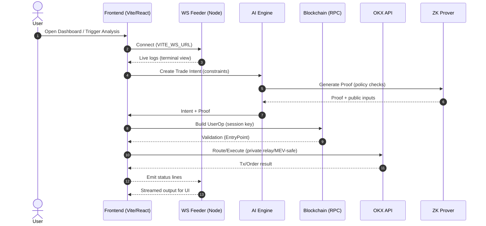
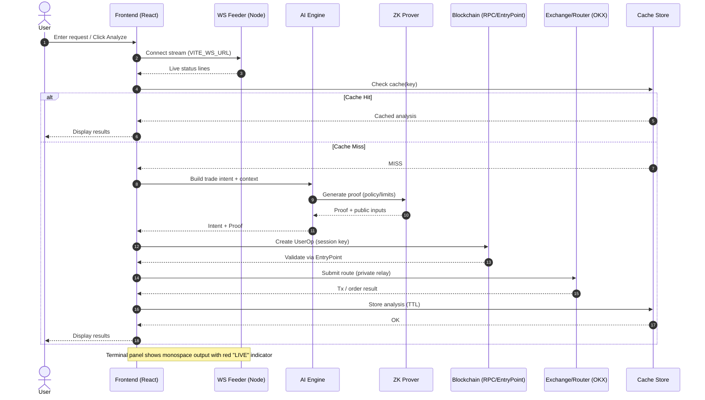
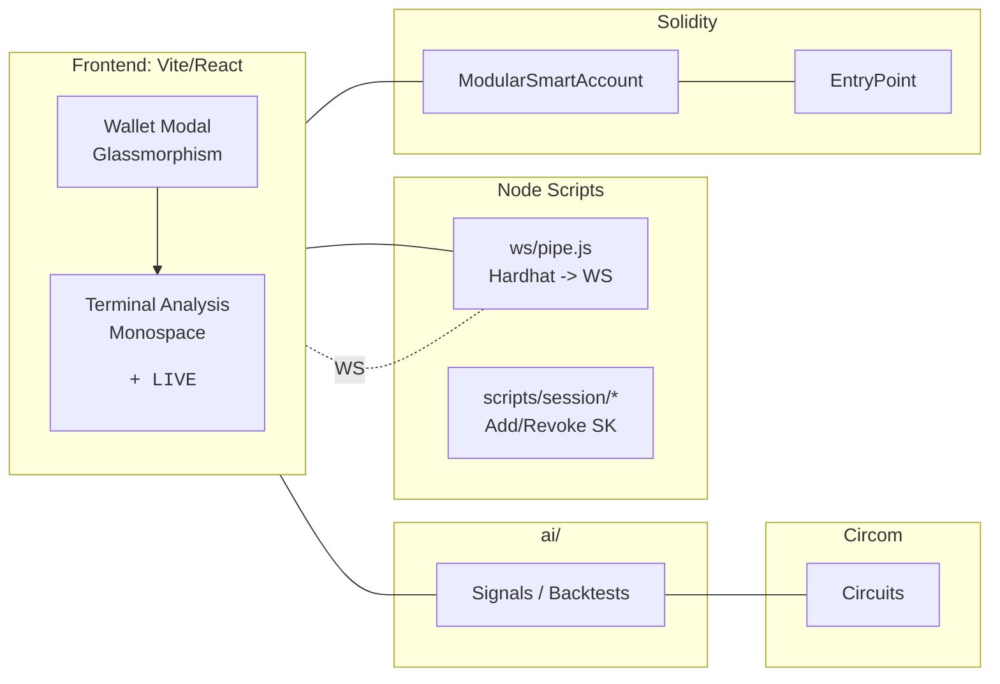

# ⚡ NeuroZK‑Trader

   

Modular ERC-4337 smart account with session keys and social recovery, ZK-verified trade pipeline, MEV-resistant routing, OKX integration, AI backtesting, and a live dashboard.

## 🧭 Overview

NeuroZK-Trader is a modular Web3 trading stack that unifies:

- ERC‑4337 smart accounts with session keys and social recovery
- ZK‑verified trade pipeline (prove policy/limits without leaking strategy)
- MEV‑resistant execution via private relays
- OKX DEX integration for liquidity
- AI backtesting/predictions
- Live React dashboard with WebSocket feeds

### ✨ Highlights at a glance

- 🔐 ERC‑4337 Smart Accounts with session keys and guardian recovery
- 🧠 ZK‑verified trade constraints (prove limits without leaking strategy)
- 🛡️ MEV‑aware routing via private relays/bundlers
- 💱 OKX integration for deep liquidity
- 📈 AI backtesting + signals
- 🖥️ Live terminal‑style dashboard with red "LIVE" indicator

## 🗺️ Workflow (Mermaid)

Visual overview of the request → analysis → execution → streaming loop.



### 🔄 Detailed Sequence (n8n‑style)



### 🧭 Module Map



### 🧩 The Problem in Web3

- **Key management & UX**: EOAs are brittle; one leaked key = total loss; no granular permissions.
- **MEV & execution risk**: Sandwiching/front‑running → slippage and losses.
- **Trust in strategies**: Hard to prove compliance with risk limits without revealing alpha.
- **Operational security**: Bots/tools often need raw keys; dangerous privileges.
- **Fragmented infra**: Data, routing, execution across providers; inconsistent reliability/latency.

### ✅ Our Solution

- **Modular ERC‑4337 Smart Account**: Policy‑driven account with fine‑grained permissions.
- **Session Keys + Social Recovery**: Temporary, scoped keys (limits, expiry) and guardian recovery.
- **ZK‑Verified Trading**: Proofs that trades respect constraints (risk caps, model bounds) without revealing the model.
- **MEV‑Resistant Routing**: Private order flow via Flashbots/relays; bundling to reduce exposure.
- **OKX DEX Integration**: Access deep liquidity; unified routing.
- **AI Core & Backtesting**: Train/predict signals; validate strategies offline; stream predictions live.
- **Live Dashboard**: Real‑time predictions/trades/health via WS; clean Vite/React UI.

### 🔗 How the System Works

1. **Setup & Accounts**
   - Deploy factories/`EntryPoint`; create session keys via `scripts/session/*.js` (scoped TTL/limits), encrypted in `SESSION_KEYS_DIR` using `SESSION_VAULT_PASSPHRASE`.
2. **Signal → Intent**
   - AI module emits signals (e.g., BTC‑USDT prob_up). Create a trade intent with constraints (size, slippage, risk bounds).
3. **ZK Proof**
   - Circom circuits (under `zk/`) prove the intent respects policy; share proof + public inputs only.
4. **UserOperation (ERC‑4337)**
   - Build a `UserOperation` signed by a session key (no owner key exposure) for smart‑account execution.
5. **MEV‑Safe Submission**
   - Submit via bundler/Flashbots/private relays to minimize front‑running.
6. **Execution & Observability**
   - Execute swap via OKX/router; `scripts/ws/feeder.js` streams prediction/trade/health; frontend subscribes to `VITE_WS_URL`.
7. **Recovery & Ops**
   - Guardians can rotate ownership; session keys are revocable/time‑bounded.


## 🕵️Example Scenario

Goal: Let a trading bot place orders for 1 hour using your smart account, while you keep ownership and recovery controls. Off‑chain, use OKX API to place market/limit orders with clear error handling.

### On‑chain: Smart Account usage
- Contracts: `contracts/ModularSmartAccount.sol`
- What you do:
  1. Deploy the smart account with your owner EVM key and an EntryPoint address (tests use a dummy `MinimalEntryPoint`).
  2. Add a temporary “session key” for your bot for 1 hour.
  3. Bot acts using its session key (only while valid).
  4. You can revoke the session key anytime or recover ownership via a guardian.

- Example flow (as in `test/ModularSmartAccount.test.ts`):
  - Add a session key:
    - `msa.addSessionKey(sessionKey.address, 3600 * 1000)` emits `SessionKeyAdded`.
  - Validate:
    - `msa.isSessionKeyValid(sessionKey.address)` returns `true` until expiry.
  - Revoke:
    - `msa.revokeSessionKey(sessionKey.address)` emits `SessionKeyRevoked`, and `isSessionKeyValid` returns `false`.
  - Social recovery:
    - A guardian calls `msa.recoverOwner(newOwner)` to change ownership, emitting `OwnerRecovered`.

- Commands (terminal):
  - Compile/tests:
    ```bash
    npm run test:contracts:ts
    ```

### Off‑chain: Trading with OKX
- Client tests: `tests/okx/*.test.ts`
- What you do:
  1. Put OKX API credentials in `.env`:
     ```env
     OKX_API_KEY=...
     OKX_API_SECRET=...
     OKX_PASSPHRASE=...
     OKX_BASE_URL=https://www.okx.com   # or demo URL
     ```
  2. Run tests that verify:
     - Signed headers are attached correctly.
     - Market/limit order params are validated (e.g., limit orders require `px`).
     - API error codes are surfaced as `OkxError`.

- Commands (terminal):
  - Run OKX tests with explicit config:
    ```bash
    npx jest --config jest.config.js --verbose --runTestsByPath tests/okx/client.test.ts tests/okx/orders.test.ts
    ```

### 💎What you gain
- Secure delegation: Session keys let a bot act for a limited time without giving it full control.
- Recovery: Guardians can recover ownership if needed.
- Typed & tested: TypeChain for contract types, Jest for OKX flows, Hardhat for Solidity tests.
- Headless workflow: Everything runs from the terminal; no UI required.


## 🚀 Quick Start

- Requirements: Node.js 20+, Python 3.11+, Git
- Install Node deps:
  ```bash
  npm install
  ```
- Frontend install & dev:
  ```bash
  cd frontend/dashboard && npm install && npm run dev
  ```
- AI deps:
  ```bash
  pip install -r ai/requirements.txt
  ```

## 🔧 Environment

Copy `.env.examples` as a base. For local dev, place values in a `.env` at the repo root (never commit secrets):

Important entries:
- `SEPOLIA_RPC_URL` – testnet RPC
- `DEPLOYER_KEY` – deployer private key (0x...)
- `SESSION_VAULT_PASSPHRASE`, `SESSION_KEYS_DIR` – session key vault
- `WS_PORT` – local WS feeder port
- OKX/Binance keys (optional for real data)

## 🧩 Contracts

- Hardhat config: `hardhat.config.js` (networks: `sepolia`, `xlayer`)
- Compile & Test:
  ```bash
  npx hardhat compile
  npm run test:contracts
  ```
- Deploy (local):
  ```bash
  SEPOLIA_RPC_URL=... DEPLOYER_KEY=... npx hardhat run scripts/bridge/deployBridge.js --network sepolia
  ```

### 🛡️ Session Keys

- Add session key:
  ```bash
  node scripts/session/add-session-key.js --account <smartAccount> --valid 3600
  ```
- Revoke session key:
  ```bash
  node scripts/session/revoke-session-key.js --account <smartAccount> --key <address>
  ```

## 🧮 ZK (Circom)
- Circuits under `zk/circuits/` with a README and test workflow via `snarkjs`.

## 🧠 AI Core & Backtesting

- Train or predict via `ai/core.py`; backtest via `ai/backtest.py`:
  ```bash
  python -m ai.core train --inst BTC-USDT --bar 1m --horizon 5
  python -m ai.backtest --inst BTC-USDT --bar 1m --horizon 5 --limit 2000 --plotOut backtests/equity.png
  ```
- Models: store artifacts under `models/` (ignored by git) or an object store; AI Docker can fetch/copy them at runtime.

## MEV Router

- Docs in `scripts/MEV_ROUTER.md`
- Run locally:
  ```bash
  node scripts/mevRouter.js
  ```

## Dashboard

- Vite + React + Tailwind in `frontend/dashboard/`.
- Local feeder for live data:
  ```bash
  npm run ws:feeder   # ws://localhost:8080
  cd frontend/dashboard && npm run dev
  ```

## Docker

- AI service: `docker/ai.Dockerfile`
- MEV router: `docker/mev-router.Dockerfile`

Build locally:
```bash
docker build -f docker/ai.Dockerfile -t neurozk/ai:dev .
docker build -f docker/mev-router.Dockerfile -t neurozk/mev-router:dev .
```

## CI/CD (GitHub Actions)
- Workflow: `.github/workflows/ci.yml`
- Jobs: contracts compile/tests, optional testnet deploy on main/tags, build & push Docker images to GHCR.
- Required GitHub Secrets (Settings → Secrets and variables → Actions):
  - `RPC_URL` → used as `SEPOLIA_RPC_URL` in workflow
  - `DEPLOYER_PRIVATE_KEY` → used as `DEPLOYER_KEY`
- Optional:
  - `WORKFLOW_DEPLOY_SCRIPT` (default `scripts/deployBridge.js`)

## 🧪 Tests

- Contract tests (session keys, guardians): `test/ModularSmartAccount.test.ts`
  ```bash
  npm run test:contracts
  ```
- OKX tests: `npm run test:okx`


### ⚡ Quick commands recap
- Contracts (TS tests): `npm run test:contracts:ts`
- Single contract test: `npx hardhat test test/ModularSmartAccount.test.ts --show-stack-traces --bail`
- OKX tests: `npx jest --config jest.config.js --verbose --runTestsByPath tests/okx/client.test.ts tests/okx/orders.test.ts`

## 🖥️ Live Demo (for judges)

Make it visual but zero‑risk. Use local tests and a simple flow.

### 1) Contracts demo (session keys & guardians)
```bash
npm run demo:contracts
```
Shows: add/revoke session key, owner recovery event, and validations.

### 2) OKX client demo (signed requests, orders)
```bash
npm run demo:okx
```
Shows: signed headers, market/limit order validation, and error handling.

### 3) Optional: live dashboard
- Start feeder: `npm run ws:feeder` (ws://localhost:8080)
- Start frontend: `cd frontend/dashboard && npm run dev`

Tips:
- For real networks, set `SEPOLIA_RPC_URL` and `DEPLOYER_KEY` in `.env`. For demos, tests are enough.
- Never commit secrets; `.env*` is git‑ignored.

## 📝 Notes
- Git ignores `session_keys/`, `models/`, `.env*`, build artifacts.
- On Windows, line endings may convert to CRLF. To normalize, add `.gitattributes`:
  ```gitattributes
  * text=auto
  *.sol text eol=lf
  *.ts text eol=lf
  *.js text eol=lf
  *.yml text eol=lf
  *.py text eol=lf
  ```

---

## Pro Guide: Architecture, Workflow & Ops

This section distills how the pieces fit together, the end‑to‑end developer workflow, and operational best practices.

### System Architecture (High‑level)

- __Contracts (`contracts/`)__
  - `ModularSmartAccount.sol`: ERC‑4337 smart account with session keys and guardians for recovery.
  - EntryPoint (tests use `MinimalEntryPoint`) for `UserOperation` validation/execution.
- __ZK Circuits (`zk/`)__
  - Circom circuits validate trade constraints without revealing model internals.
- __AI (`ai/`)__
  - Signal generation and backtesting. Produces intents + constraints for verification.
- __OKX Client (`tests/okx`, `scripts/okx`)__
  - Signed REST requests, validation, and order helpers.
- __Feeder (`scripts/ws/`)__
  - Pipes CLI/Hardhat output to WebSocket for live dashboard consumption.
- __Frontend (`frontend/dashboard/`)__
  - Vite + React. Live terminal‑style analysis view, wallet panels, and health cards.

Data & control flow:
1) AI emits a signal → 2) Build a trade intent → 3) Prove constraints (ZK) → 4) Create `UserOperation` with a session key → 5) Submit via bundler/relay → 6) Execute swap → 7) Stream logs/health to dashboard via WS.

### Workflow (Dev to Demo)

1. __Install & Build__
   - Root deps: `npm install`
   - Frontend: `cd frontend/dashboard && npm install`

2. __Environment__
   - Root `.env` (or `.env.local`): RPC, keys, OKX creds, WS settings.
   - Frontend `frontend/dashboard/.env.local` for UI runtime (Vite uses `VITE_` prefix):
     - `VITE_PUBLIC_RPC` – RPC endpoint for the UI provider.
     - `VITE_WALLET_PK` (dev only) – enables auto‑wallet boot in the browser; address appears without clicking Connect.
     - `VITE_WS_URL` – WebSocket endpoint for live logs (e.g., `ws://localhost:8090`).

3. __Contracts__
   - Compile/tests: `npx hardhat compile` / `npm run test:contracts`

4. __Live Logs (WS)__
   - Start feeder: `node scripts/ws/pipe.js --name contracts --tee -- npx hardhat test test/ModularSmartAccount.test.ts --show-stack-traces --bail`
   - This streams real Hardhat output to WS (see terminal panel in the dashboard).

5. __Frontend__
   - `cd frontend/dashboard && npm run dev`
   - Terminal analysis view shows a monospace `<pre>` with preserved spacing, appends new lines at bottom, auto‑scrolls, and a glowing red "LIVE" indicator.
   - Wallet modal uses glassmorphism with neon accents and shows address/balance.

### Frontend Wallet: Auto‑Connect from ENV

The UI auto‑connects a wallet if env is present. In `frontend/dashboard/src/context/AuthContext.tsx` we bootstrap on load:

- Looks for `VITE_WALLET_PK` (or `VITE_DEMO_PK`) and `VITE_PUBLIC_RPC`.
- Creates an in‑memory `ethers.Wallet` bound to the provider and exposes `address`.
- No manual Connect button required in the modal header.

Dev‑only guidance:
- Never commit real keys. Use a disposable/test key locally.
- After editing `.env.local`, __restart__ the Vite dev server for changes to take effect.

Optional read‑only mode (if you prefer not to supply a PK):
- We can extend the UI to support `VITE_WALLET_ADDRESS` which shows balances without signer capabilities.

### Environment Matrix (Root vs Frontend)

- __Root `.env`__ (used by Node/Hardhat/tests):
  - `SEPOLIA_RPC_URL`, `DEPLOYER_KEY`, `SESSION_VAULT_PASSPHRASE`, `SESSION_KEYS_DIR`, `WS_PORT`, `WS_HOST`, provider/API keys, etc.
- __Frontend `.env.local`__ (Vite, must prefix with `VITE_`):
  - `VITE_PUBLIC_RPC`, `VITE_WALLET_PK` (dev), `VITE_WS_URL`.

### Operational Tips

- __Session keys__: Scope TTL/limits; revoke on completion. Do not expose owner key to bots.
- __Relays__: For live networks, use private relays/bundlers to reduce MEV risk.
- __Logs__: Keep feeder isolated; sanitize secrets before streaming logs.
- __Security__: Treat any PK in the browser as dev‑only. Use read‑only provider for production UI and sign on the server or via smart account/session keys.

### Troubleshooting

- __Address not showing in UI__
  - Ensure `frontend/dashboard/.env.local` includes `VITE_PUBLIC_RPC` and `VITE_WALLET_PK`.
  - Restart `npm run dev`. Vite won’t hot‑reload new env.
  - Check DevTools console for: `ENV wallet bootstrap failed`.

- __No live logs in dashboard__
  - Start feeder with `scripts/ws/pipe.js` and confirm `[pipe] connected` in the terminal.
  - Set `VITE_WS_URL` in frontend env to your feeder URL.

- __Hardhat tests pass but UI balance is 0__
  - The dev key may be unfunded. This is normal for demos.

### Demo Script (10 minutes)

1. Start WS feeder (contracts test). Confirm live stream in the dashboard.
2. Show wallet modal: address auto‑appears (dev key). Session key concept recap.
3. Highlight terminal: preserved spacing, red pulsing "LIVE" indicator, auto‑scroll.
4. Optional: guardian/session key revoke flow via scripts.

---

For issues, open GitHub issues with: OS, Node version, steps, console logs, and env entries (redacted).
